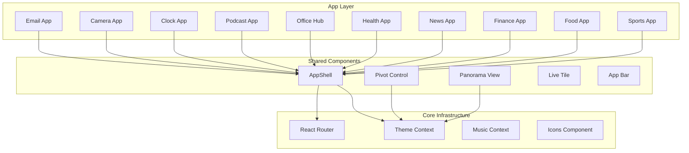

# Design Document: Windows Phone 8.1 Daily Apps

## Overview

This design document outlines the architecture and implementation approach for adding 10 essential day-to-day applications to the Windows Phone 8.1 web simulation. Each app will follow the authentic Metro UI design language with panoramic views, pivot controls, live tiles, and typography-focused aesthetics.

The implementation leverages the existing React-based architecture with React Router for navigation, CSS custom properties for theming, and the established AppShell component pattern for consistent app structure.

## Architecture

### High-Level Architecture



### Component Architecture Pattern

Each app follows a consistent structure:

```
src/apps/{AppName}/
├── {AppName}.jsx       # Main app component
├── {AppName}.css       # App-specific styles
├── components/         # App-specific sub-components (if needed)
│   ├── {Feature}View.jsx
│   └── {Feature}Detail.jsx
└── data.js            # Mock data for the app
```

## Components and Interfaces

### Shared UI Components

#### PivotControl Component

A horizontal tab navigation component for switching between views within an app.

```jsx
interface PivotControlProps {
  items: Array<{
    key: string;
    label: string;
    content: React.ReactNode;
  }>;
  activeKey?: string;
  onSelect?: (key: string) => void;
}
```

#### PanoramaView Component

A wide scrolling canvas that extends beyond the screen for immersive content browsing.

```jsx
interface PanoramaViewProps {
  title: string;
  sections: Array<{
    key: string;
    header: string;
    content: React.ReactNode;
  }>;
  backgroundImage?: string;
}
```

#### AppBar Component

Bottom toolbar with action buttons following Windows Phone conventions.

```jsx
interface AppBarProps {
  actions: Array<{
    icon: string;
    label: string;
    onClick: () => void;
  }>;
  menuItems?: Array<{
    label: string;
    onClick: () => void;
  }>;
}
```

### App-Specific Components

#### Email App Components

| Component | Purpose |
|-----------|---------|
| EmailList | Displays list of emails with sender, subject, preview |
| EmailDetail | Shows full email content with reply/forward actions |
| ComposeEmail | Email composition form with Metro-styled inputs |

#### Camera App Components

| Component | Purpose |
|-----------|---------|
| Viewfinder | Camera preview with capture controls |
| CameraRoll | Grid of captured photos |
| CameraSettings | Flash, timer, aspect ratio options |

#### Clock App Components

| Component | Purpose |
|-----------|---------|
| AlarmList | List of alarms with toggle switches |
| AlarmEditor | Time picker and repeat day selector |
| WorldClock | Multiple timezone display |
| Stopwatch | Elapsed time with lap tracking |
| Timer | Countdown timer with duration picker |

#### Podcast App Components

| Component | Purpose |
|-----------|---------|
| PodcastList | Grid/list of subscribed podcasts |
| EpisodeList | Episodes with download status |
| PodcastPlayer | Playback controls integrated with MusicContext |

#### Office Hub Components

| Component | Purpose |
|-----------|---------|
| DocumentList | Recent documents with type icons |
| DocumentViewer | Simulated document display |
| PlacesView | Storage locations (OneDrive, Phone) |

#### Health App Components

| Component | Purpose |
|-----------|---------|
| TodayView | Circular progress indicators for metrics |
| HistoryChart | Weekly/monthly activity charts |
| GoalsEditor | Target configuration form |

#### News App Components

| Component | Purpose |
|-----------|---------|
| ArticleCard | Headline with image and source |
| ArticleDetail | Full article reader view |
| CategorySection | Panorama section for news category |

#### Finance App Components

| Component | Purpose |
|-----------|---------|
| WatchlistItem | Stock with price, change, mini chart |
| StockDetail | Price chart and statistics |
| CurrencyConverter | Exchange rate calculator |

#### Food App Components

| Component | Purpose |
|-----------|---------|
| RecipeCard | Recipe preview with image and metadata |
| RecipeDetail | Ingredients, steps, nutrition |
| ShoppingList | Checkable ingredient list |

#### Sports App Components

| Component | Purpose |
|-----------|---------|
| ScoreCard | Live game score display |
| TeamDetail | Schedule, roster, standings |
| SportsNews | Sports headlines list |

#### Ringtones UI Components

| Component | Purpose |
|-----------|---------|
| RingtoneList | Categorized list of ringtones with play controls |
| RingtoneItem | Individual ringtone with name, duration, play button |
| RingtonePlayer | Audio playback controller with visual indicator |

## Data Models

### Email Data Model

```typescript
interface Email {
  id: string;
  sender: {
    name: string;
    email: string;
    avatar?: string;
  };
  recipients: string[];
  subject: string;
  body: string;
  preview: string;
  timestamp: Date;
  isRead: boolean;
  isFlagged: boolean;
  hasAttachment: boolean;
}
```

### Alarm Data Model

```typescript
interface Alarm {
  id: string;
  time: string; // HH:mm format
  label: string;
  isEnabled: boolean;
  repeatDays: number[]; // 0-6 for Sun-Sat
  sound: string;
}

interface WorldClockCity {
  id: string;
  city: string;
  country: string;
  timezone: string;
  offset: number;
}
```

### Podcast Data Model

```typescript
interface Podcast {
  id: string;
  title: string;
  author: string;
  artwork: string;
  description: string;
  episodes: Episode[];
}

interface Episode {
  id: string;
  title: string;
  description: string;
  duration: number; // seconds
  publishDate: Date;
  audioUrl: string;
  isDownloaded: boolean;
  playbackPosition: number;
}
```

### Document Data Model

```typescript
interface Document {
  id: string;
  name: string;
  type: 'word' | 'excel' | 'powerpoint';
  lastModified: Date;
  size: number;
  location: 'phone' | 'onedrive';
  preview?: string;
}
```

### Health Data Model

```typescript
interface DailyHealth {
  date: Date;
  steps: number;
  calories: number;
  distance: number; // meters
  activeMinutes: number;
}

interface HealthGoals {
  dailySteps: number;
  dailyCalories: number;
  dailyDistance: number;
}
```

### News Article Data Model

```typescript
interface Article {
  id: string;
  headline: string;
  source: string;
  category: 'headlines' | 'tech' | 'sports' | 'business' | 'entertainment';
  imageUrl: string;
  content: string;
  publishedAt: Date;
}
```

### Finance Data Model

```typescript
interface Stock {
  symbol: string;
  name: string;
  price: number;
  change: number;
  changePercent: number;
  history: number[]; // Last 30 days
}

interface Currency {
  code: string;
  name: string;
  rate: number; // Rate to USD
  symbol: string;
}
```

### Recipe Data Model

```typescript
interface Recipe {
  id: string;
  title: string;
  imageUrl: string;
  prepTime: number; // minutes
  cookTime: number;
  servings: number;
  rating: number;
  ingredients: Ingredient[];
  steps: string[];
  nutrition: {
    calories: number;
    protein: number;
    carbs: number;
    fat: number;
  };
}

interface Ingredient {
  name: string;
  amount: string;
  unit: string;
}

interface ShoppingListItem {
  id: string;
  name: string;
  isChecked: boolean;
}
```

### Sports Data Model

```typescript
interface Game {
  id: string;
  sport: 'football' | 'basketball' | 'baseball' | 'soccer';
  homeTeam: Team;
  awayTeam: Team;
  homeScore: number;
  awayScore: number;
  status: 'scheduled' | 'live' | 'final';
  startTime: Date;
  period?: string;
}

interface Team {
  id: string;
  name: string;
  abbreviation: string;
  logo: string;
  primaryColor: string;
}
```

### Ringtone Data Model

```typescript
interface Ringtone {
  id: string;
  name: string;
  category: 'nokia' | 'windows' | 'custom';
  duration: number; // seconds
  audioUrl: string;
}

interface RingtoneState {
  selectedRingtoneId: string;
  playingRingtoneId: string | null;
  ringtones: Ringtone[];
}
```

### Icon Additions

New icons required for the apps:

```typescript
const NEW_ICONS = {
  // Email
  inbox: '...',
  reply: '...',
  replyAll: '...',
  flag: '...',
  
  // Camera
  flash: '...',
  flashOff: '...',
  switchCamera: '...',
  
  // Clock
  stopwatch: '...',
  timer: '...',
  worldClock: '...',
  
  // Podcast
  podcast: '...',
  
  // Office
  word: '...',
  excel: '...',
  powerpoint: '...',
  onedrive: '...',
  
  // Health
  heart: '...',
  steps: '...',
  flame: '...',
  
  // News
  newspaper: '...',
  
  // Finance
  trending: '...',
  chart: '...',
  
  // Food
  restaurant: '...',
  shoppingCart: '...',
  
  // Sports
  trophy: '...',
  scoreboard: '...',
  
  // Ringtones
  ringtone: '...',
  check: '...',
};
```


## Correctness Properties

*A property is a characteristic or behavior that should hold true across all valid executions of a system—essentially, a formal statement about what the system should do. Properties serve as the bridge between human-readable specifications and machine-verifiable correctness guarantees.*

Based on the prework analysis, the following correctness properties have been identified:

### Property 1: Email List Rendering Completeness

*For any* email object with sender, subject, preview, and timestamp fields, the rendered email list item SHALL contain all of these fields in the output.

**Validates: Requirements 1.2**

### Property 2: Unread Email Count Accuracy

*For any* collection of emails, the unread count displayed on the Live Tile SHALL equal the count of emails where `isRead` is `false`.

**Validates: Requirements 1.5**

### Property 3: Alarm Creation Round-Trip

*For any* valid alarm configuration (time, repeat days, label), creating an alarm and then retrieving it SHALL return an alarm with identical values.

**Validates: Requirements 3.2**

### Property 4: Stopwatch Lap Time Consistency

*For any* sequence of stopwatch start, lap, and stop actions, the sum of all lap times SHALL equal the total elapsed time.

**Validates: Requirements 3.3**

### Property 5: Timer Countdown Accuracy

*For any* timer with initial duration D, after N seconds of countdown (where N ≤ D), the remaining time SHALL equal (D - N).

**Validates: Requirements 3.4**

### Property 6: World Clock Timezone Calculation

*For any* world clock city with a timezone offset, the displayed time SHALL equal the current UTC time plus the timezone offset.

**Validates: Requirements 3.5**

### Property 7: Podcast Episode List Completeness

*For any* podcast episode object, the rendered episode list item SHALL contain title, duration, and download status.

**Validates: Requirements 4.2**

### Property 8: Document List Rendering with Type Icons

*For any* document object with name, type, and lastModified fields, the rendered document list item SHALL contain the name, the correct type-specific icon (word/excel/powerpoint), and formatted date.

**Validates: Requirements 5.2, 5.4**

### Property 9: Document Viewer Type Selection

*For any* document with a type of 'word', 'excel', or 'powerpoint', opening the document SHALL render the viewer component corresponding to that type.

**Validates: Requirements 5.3**

### Property 10: Health Progress Indicator Calculation

*For any* health data with steps, calories, and distance values, and corresponding goals, the progress percentage for each metric SHALL equal (current value / goal value) × 100, capped at 100%.

**Validates: Requirements 6.2**

### Property 11: Health Goals Round-Trip

*For any* valid goal configuration (daily steps, daily calories), saving goals and then retrieving them SHALL return identical values.

**Validates: Requirements 6.5**

### Property 12: Article Card Rendering Completeness

*For any* article object, the rendered article card SHALL contain headline, source, image thumbnail, and relative time.

**Validates: Requirements 7.2**

### Property 13: Stock Watchlist Item Completeness

*For any* stock object, the rendered watchlist item SHALL contain symbol, price, change value, and mini chart visualization.

**Validates: Requirements 8.2**

### Property 14: Currency Conversion Accuracy

*For any* amount A in currency C1 converted to currency C2, the result SHALL equal A × (rate_C2 / rate_C1) where rates are relative to a common base currency.

**Validates: Requirements 8.5**

### Property 15: Recipe Card Rendering Completeness

*For any* recipe object, the rendered recipe card SHALL contain image, title, prep time, and rating.

**Validates: Requirements 9.2**

### Property 16: Shopping List Item Toggle Round-Trip

*For any* shopping list item, toggling its checked state and then reading it SHALL return the toggled state.

**Validates: Requirements 9.4**

### Property 17: Game Score Card Completeness

*For any* game object, the rendered score card SHALL contain both team logos, current scores, and game status.

**Validates: Requirements 10.2**

### Property 18: Ringtone Playback Toggle

*For any* ringtone, tapping it while stopped SHALL start playback, and tapping it while playing SHALL stop playback (toggle behavior).

**Validates: Requirements 11.2, 11.3**

### Property 19: Ringtone Selection Persistence

*For any* ringtone selection, the selected ringtone SHALL be highlighted with accent color and persist until a different ringtone is selected.

**Validates: Requirements 11.4**

## Error Handling

### Input Validation

| Component | Validation | Error Response |
|-----------|------------|----------------|
| Email Compose | Empty recipient | Disable send button, show hint |
| Alarm Editor | Invalid time format | Reset to valid default |
| Timer | Duration ≤ 0 | Disable start button |
| Currency Converter | Non-numeric input | Clear input, show placeholder |
| Goals Editor | Negative values | Reset to minimum (1) |

### Data Loading States

All apps SHALL implement three states for data-dependent views:

1. **Loading**: Display Metro-style loading indicator (dots animation)
2. **Empty**: Display contextual empty state message
3. **Error**: Display error message with retry option

### Graceful Degradation

- If mock data is unavailable, apps SHALL display empty state rather than crash
- If an icon is missing, apps SHALL fall back to a default icon
- If navigation fails, apps SHALL remain on current view

## Testing Strategy

### Unit Testing Approach

Unit tests will verify specific examples and edge cases:

- Component rendering with various prop combinations
- User interaction handlers (click, swipe, input)
- State management logic
- Data transformation functions

### Property-Based Testing Approach

Property-based tests will verify universal properties using a PBT library (fast-check for JavaScript):

- Each correctness property will be implemented as a property-based test
- Minimum 100 iterations per property test
- Tests will generate random valid inputs and verify properties hold

**Test Configuration:**
```javascript
// fast-check configuration
fc.configureGlobal({
  numRuns: 100,
  verbose: true
});
```

**Test Annotation Format:**
```javascript
// Feature: windows-phone-daily-apps, Property 1: Email List Rendering Completeness
// Validates: Requirements 1.2
test.prop([emailArbitrary])('email list renders all required fields', (email) => {
  // property assertion
});
```

### Test File Organization

```
src/apps/__tests__/
├── Email.test.jsx
├── Email.property.test.jsx
├── Clock.test.jsx
├── Clock.property.test.jsx
├── Finance.test.jsx
├── Finance.property.test.jsx
└── ...
```

### Testing Tools

- **Jest**: Test runner and assertion library
- **React Testing Library**: Component testing
- **fast-check**: Property-based testing library

### Coverage Goals

- Unit tests: Cover all user interactions and edge cases
- Property tests: Cover all 17 correctness properties
- Integration: Verify app registration and routing
